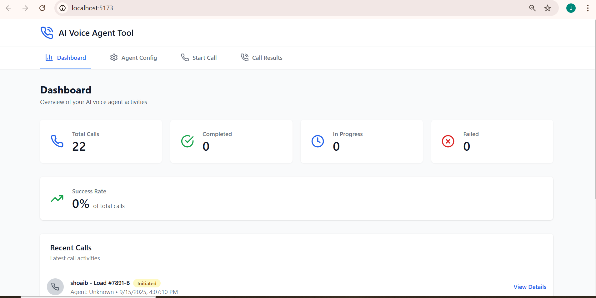

# AI Voice Agent Tool

A full-stack web application that allows administrators to configure, test, and review calls made by adaptive AI voice agents using Retell AI, built with React, FastAPI, and Supabase.

## Features

- **Agent Configuration Management**: Create and manage AI voice agent configurations with different scenarios
- **Call Triggering**: Start test calls with configured agents from an intuitive dashboard
- **Call Results Analysis**: View structured call results with key-value data and full transcripts
- **Real-time Processing**: Webhook integration for real-time call status updates
- **Emergency Detection**: Automatic detection and handling of emergency scenarios during calls

## Technology Stack

- **Frontend**: React 18, Vite, Tailwind CSS, Lucide React
- **Backend**: FastAPI, Python 3.9+
- **Database**: Supabase (PostgreSQL)
- **Voice AI**: Retell AI
- **LLM**: OpenAI GPT-4
- **Deployment**: Self-hosted

## Project Structure

```
ai-voice-agent/
├── frontend/                 # React frontend application
│   ├── src/
│   │   ├── components/      # React components
│   │   ├── services/        # API service layer
│   │   └── ...
├── backend/                 # FastAPI backend application
│   ├── app/
│   │   ├── services/        # Business logic services
│   │   ├── models.py        # Pydantic models
│   │   ├── routes.py        # API routes
│   │   └── ...
├── database/                # Database schema and migrations
└── README.md
```



## Prerequisites

Before running this application, you need:

1. **Supabase Account & Project**
   - Create a project at https://supabase.com
   - Get your project URL and API key

2. **Retell AI Account**
   - Sign up at https://retellai.com
   - Create an agent and get your API key and agent ID
   - Configure webhook URL pointing to your backend

3. **OpenAI API Key**
   - Get your API key from https://openai.com

4. **Development Environment**
   - Python 3.9+
   - Node.js 18+
   - npm or yarn

## Installation & Setup

### 1. Clone the Repository
```bash
git clone 
cd ai-voice-agent
```

### 2. Backend Setup
```bash
cd backend
python -m venv venv
source venv/bin/activate  # On Windows: venv\Scripts\activate
pip install -r requirements.txt
```

### 3. Frontend Setup
```bash
cd frontend
npm install
```

### 4. Database Setup
1. Go to your Supabase dashboard
2. Navigate to the SQL Editor
3. Run the SQL commands from `database/schema.sql`

### 5. Environment Configuration
Create a `.env` file in the `backend` directory:

```env
SUPABASE_URL=your_supabase_project_url
SUPABASE_KEY=your_supabase_anon_key
RETELL_API_KEY=your_retell_api_key
RETELL_AGENT_ID=your_retell_agent_id
OPENAI_API_KEY=your_openai_api_key
BACKEND_URL=http://localhost:8000  # For development
```

## Running the Application

### Development Mode

1. **Start the Backend** (Terminal 1):
```bash
cd backend
source venv/bin/activate  # On Windows: venv\Scripts\activate
uvicorn app.main:app --reload --port 8000
```

2. **Start the Frontend** (Terminal 2):
```bash
cd frontend
npm run dev
```

3. **Access the Application**:
   - Frontend: http://localhost:5173
   - Backend API: http://localhost:8000
   - API Documentation: http://localhost:8000/docs

## Usage Guide

### 1. Configure AI Agents

1. Navigate to the "Agent Config" tab
2. Click "New Configuration"
3. Fill in the configuration details:
   - **Name**: Descriptive name for the agent
   - **Scenario Type**: Choose between "Check-in" or "Emergency"
   - **System Prompt**: Instructions for the AI agent's behavior
   - **Conversation Flow**: Step-by-step conversation guide
   - **Emergency Triggers**: Keywords that trigger emergency protocols
   - **Advanced Settings**: Interruption sensitivity, backchannel, etc.

### 2. Start Test Calls

1. Navigate to the "Start Call" tab
2. Select an agent configuration
3. Enter driver details:
   - Driver name
   - Phone number (format: +1234567890)
   - Load number
4. Click "Start Test Call"

### 3. View Call Results

1. Navigate to the "Call Results" tab
2. View all calls with their status
3. Click "View Details" on any call to see:
   - Structured data extraction
   - Full conversation transcript
   - Call timing and duration
   - Emergency detection results

## Scenarios Implemented

### Scenario 1: Driver Check-in ("Dispatch")
- Agent calls driver about specific load
- Determines driver status through open-ended questions
- Dynamically pivots questioning based on responses
- Extracts: call outcome, driver status, location, ETA

### Scenario 2: Emergency Protocol
- Detects emergency trigger phrases during routine calls
- Immediately switches to emergency protocol
- Gathers critical safety information
- Flags for human dispatcher escalation
- Extracts: emergency type, location, escalation status

## API Endpoints

### Agent Configuration
- `GET /api/agent-configs` - List all configurations
- `POST /api/agent-configs` - Create new configuration
- `GET /api/agent-configs/{id}` - Get specific configuration
- `PUT /api/agent-configs/{id}` - Update configuration
- `DELETE /api/agent-configs/{id}` - Delete configuration

### Call Management
- `POST /api/calls/start` - Start a new call
- `GET /api/calls` - List all calls
- `GET /api/calls/{id}` - Get call details
- `GET /api/calls/{id}/results` - Get call results

### Webhooks
- `POST /api/retell-webhook` - Retell AI webhook endpoint
- `WS /api/llm-websocket` - WebSocket for real-time LLM integration

## Design Choices

### Architecture Decisions
1. **Microservice-like Separation**: Clear separation between frontend, backend, and external services
2. **Event-Driven Processing**: Uses webhooks for real-time call status updates
3. **Structured Data Extraction**: AI-powered post-processing for consistent data format
4. **Modular Configuration**: Flexible agent configuration system for different scenarios

### Technology Justifications
1. **FastAPI**: High-performance async API with automatic documentation
2. **React**: Component-based UI with excellent developer experience
3. **Supabase**: PostgreSQL with real-time features and easy setup
4. **Retell AI**: Specialized voice AI platform with human-like conversation capabilities
5. **OpenAI GPT-4**: Advanced language model for transcript analysis

### Voice Experience Optimizations
- **Backchannel**: Enabled for natural conversation flow
- **Filler Words**: Used to make agent sound more human
- **Interruption Handling**: Configurable sensitivity for natural conversations
- **Emergency Detection**: Real-time keyword monitoring during calls

## Deployment

### Production Environment Variables
```env
SUPABASE_URL=your_production_supabase_url
SUPABASE_KEY=your_production_supabase_key
RETELL_API_KEY=your_retell_api_key
RETELL_AGENT_ID=your_retell_agent_id
OPENAI_API_KEY=your_openai_api_key
BACKEND_URL=https://your-production-domain.com
```

### Retell AI Webhook Configuration
Set your webhook URL in Retell AI dashboard to:
```
https://your-production-domain.com/api/retell-webhook
```

## Troubleshooting

### Common Issues

1. **Database Connection Issues**
   - Verify Supabase URL and API key
   - Check if database schema is properly created

2. **Retell AI Call Failures**
   - Verify API key and agent ID
   - Check webhook URL configuration
   - Ensure phone numbers are in correct format

3. **OpenAI Processing Errors**
   - Verify API key and quota
   - Check for rate limiting issues

4. **Frontend API Errors**
   - Verify backend is running on correct port
   - Check CORS configuration

### Logs
- Backend logs: Check terminal running uvicorn
- Frontend logs: Check browser developer console
- Database logs: Check Supabase dashboard

## Contributing

1. Fork the repository
2. Create a feature branch
3. Make your changes
4. Test thoroughly
5. Submit a pull request

## License

This project is licensed under the MIT License - see the LICENSE file for details."# ai-voice-retel" 
